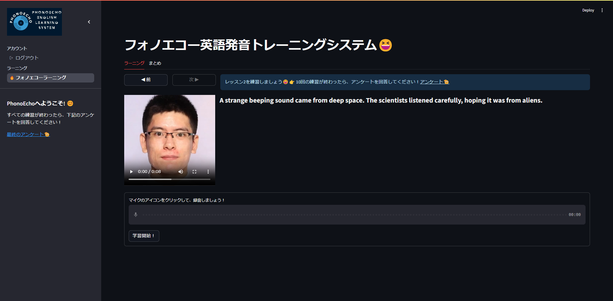

# PhonoEcho
PhonoEcho is a multi-modal English pronunciation learning platform built with Streamlit. It combines lesson content (text + video), microphone recording, Azure Speech pronunciation assessment, and visual feedback to help learners practice and track progress.



## Highlights
- Streamlit-based UI with lesson navigation and progress tracking.
- Pronunciation assessment via Azure Cognitive Services (scores + error types).
- Visual feedback (radar chart, waveform annotations, error charts).
- Session history saved to local JSON for progress over time.
- Optional AI tutor feedback via Azure OpenAI or Gemini.

## Project Structure (focus on `app/`)
The `app/` directory contains the core application logic and Streamlit pages.

- `app/echo_app.py`
  - Main Streamlit entry point and navigation.
  - Routes users to login/register and the learning page.
- `app/user.py`
  - User model, password hashing, and per-user storage paths.
  - Loads/saves user info and practice history.
- `app/dataset.py`
  - Loads lesson assets (text and video) from `database/learning_database/<user>/`.
- `app/learn/echo_learning.py`
  - Primary learning workflow: recording, assessment, scoring, charts, and history.
  - Saves results to JSON and renders visual summaries.
- `app/ai_chat.py`
  - Azure OpenAI helper for pronunciation feedback.
- `app/gemini_chat.py`
  - Gemini helper for pronunciation feedback (standalone chat demo).
- `app/learn/report.py`
  - Batch analysis of saved pronunciation JSON files.
- `app/learn/chatbox.py`
  - Deprecated chat UI (kept for reference).
- `app/learn_st.py`
  - Audio recorder and waveform demo page.
- `app/elicited_imitation.py`
  - Separate elicited imitation task (collects repeated recordings).
- `app/account/`
  - Alternate login/register/reset pages (legacy/demo flow).
- `app/tools/`
  - Supporting tools (Azure avatar synthesis, TTS, radar chart utility, pre-study data collection).

## Data Layout
The project stores lesson content and user history under `database/`.

Example layout:
```
database/
  all_users/
    users_info.json
  learning_database/
    <user_name>/
      *.txt
      *.mp4
  <user_name>/
    practice_history/
      YYYY-MM-DD/
        <lesson>-<timestamp>.json
      scores/
        lesson_scores.json
        error_history.json
```

## Setup
1) Create and activate a virtual environment.
2) Install dependencies.

Example:
```
python -m venv .venv
source .venv/bin/activate
pip install -r requirements.txt
```

## Secrets Configuration
The app uses `st.secrets` for API keys. Create or update `.streamlit/secrets.toml` with the following structure:
```
[Azure_Speech]
SPEECH_KEY = "..."
SPEECH_REGION = "..."

[AzureGPT]
AZURE_OPENAI_ENDPOINT = "..."
AZURE_OPENAI_API_KEY = "..."

[Gemini]
GOOGLE_API_KEY = "..."

[Azure_Avatar]
SPEECH_ENDPOINT = "..."
SUBSCRIPTION_KEY = "..."
```
Notes:
- Azure Speech is required for pronunciation assessment.
- Azure OpenAI and Gemini are optional, but those features will not work without keys.
- Azure Avatar is only needed for the avatar synthesis tool.

## Running the App
Main app:
```
streamlit run app/echo_app.py
```

Other Streamlit pages can be run directly if needed:
```
streamlit run app/elicited_imitation.py
streamlit run app/learn/report.py
```

## Workflow Summary
1) User logs in or registers.
2) Lessons are loaded from `database/learning_database/<user>/`.
3) The learner records audio and submits it.
4) Azure Speech returns scores and error types.
5) The app saves JSON history and renders charts.
6) Optional AI feedback is generated from current errors.

## Notes and Tips
- Ensure `database/all_users/users_info.json` exists before running.
- If lesson lists appear empty, check the lesson folder for matching `.txt` and `.mp4` files.
- Audio recording requires a supported browser and microphone permissions.

## License
No license specified.
